# SplashNet — Proof of Deliverables

Reference: SplashNet BRD v4.2 (Phase 1 Base Build, ₱130,000 scope) plus the
extensions commissioned during development. Every claim below is either
machine-verified (QA evidence) or visually proven (screenshot evidence in
[`screenshots/`](./screenshots/)). QA state at signing: build 0 errors ·
unit 12/12 · API matrix 40/40 · outage drills passed · daily backups ·
5-minute health monitoring.

---

## Part 1 — BRD §3 deliverables → proof map

| # | BRD deliverable | Status | Where to verify |
|---|---|---|---|
| 1 | Role-based Admin UI | ✅ DELIVERED+ | `/` (shot 02); roles ADMIN/OPERATOR/VIEWER + ADVERTISER + VENDOR; users page (shot 06) |
| 2 | Advertiser/Campaign CRUD | ✅ DELIVERED+ | Admin campaigns (shot 03) **and** self-service portal (shots 08–10) |
| 3 | Strict Asset Whitelisting | ✅ DELIVERED | WebP ≤150 KB post-compression (413 over cap; QA #creative-audit); CDN-hosted |
| 4 | Asset hosting on CDN domain | ✅ DELIVERED | `cdn.nxph.site` (MinIO-backed) |
| 5 | Visual Hourly Calendar Scheduler | ✅ DELIVERED | `/scheduler` (shot 04) |
| 6 | Pre-Commit Overlap Blocker (SQL) | ✅ DELIVERED | SQL intersection + FOR UPDATE; 409 verified (QA matrix) |
| 7 | Targeting: City / Env / Cluster | ✅ DELIVERED+ | plus registry **Areas** drill-down (QA matrix) |
| 8 | splash.js SDK, 150 ms fail-open | ✅ DELIVERED+ | v11: fail-open + background retry + gate-grants-reward; self-updating |
| 9 | /api/v1/ad/fetch <50 ms, Redis write-through | ✅ DELIVERED | ~4 ms app time (Server-Timing); outage drills |
| 10 | Fallback creatives | ✅ DELIVERED | verified across all QA scenarios |
| 11 | Wildcard CORS | ✅ DELIVERED | ad endpoints only (L4 security check) |
| 12 | Asia/Manila normalization | ✅ DELIVERED | unit-tested (6/6) incl. midnight rollover |
| 13 | WebP pipeline 150 KB cap | ✅ DELIVERED | admin + portal uploads |
| 14 | Raw hit stream (§6) | ✅ DELIVERED+ | plus geo signals, vendor attribution, reward ledger |

**Extensions beyond BRD** (delivered, no extra charge unless noted):
free-minutes economy (budget/cost/vendor income), coin gate + interstitial
formats, sites/server-driven config (install-once), operator console,
advertiser portal (Meta/Google-parity builder), vendo-admin overlay policy,
demo simulation, two-stylesheet mobile/desktop parity, hosted income page,
health monitoring + backups, this proof pack. Module C connector remains
the quoted commercial add-on.

## Part 2 — UI checklist with nav proof

Every nav item of every surface, each captured as evidence. All URLs live
on `splash.nxph.site` unless noted.

### A. Auth
| Item | Nav path | Proof |
|---|---|---|
| Chrome-less login | `/login` | 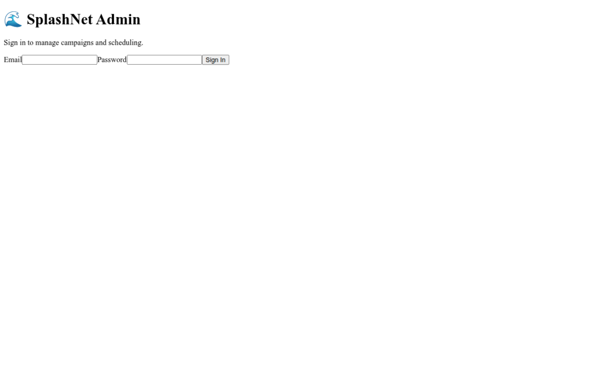 |

### B. Admin Console (staff login)
| Nav item | Route | Proof |
|---|---|---|
| Dashboard (revenue, review queue) | `/` | 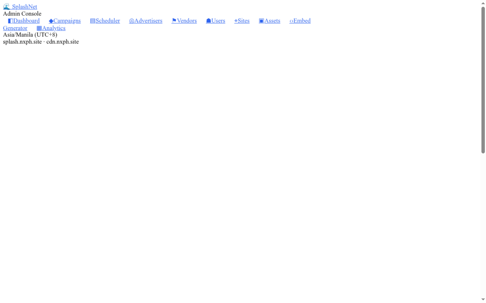 |
| Campaigns (approve & activate) | `/campaigns` | 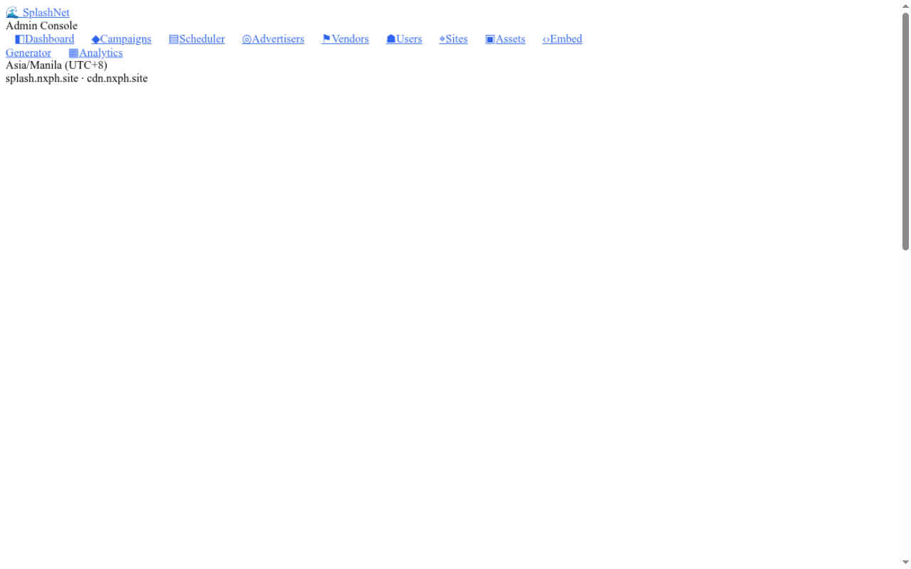 |
| Scheduler (hourly calendar) | `/scheduler` | 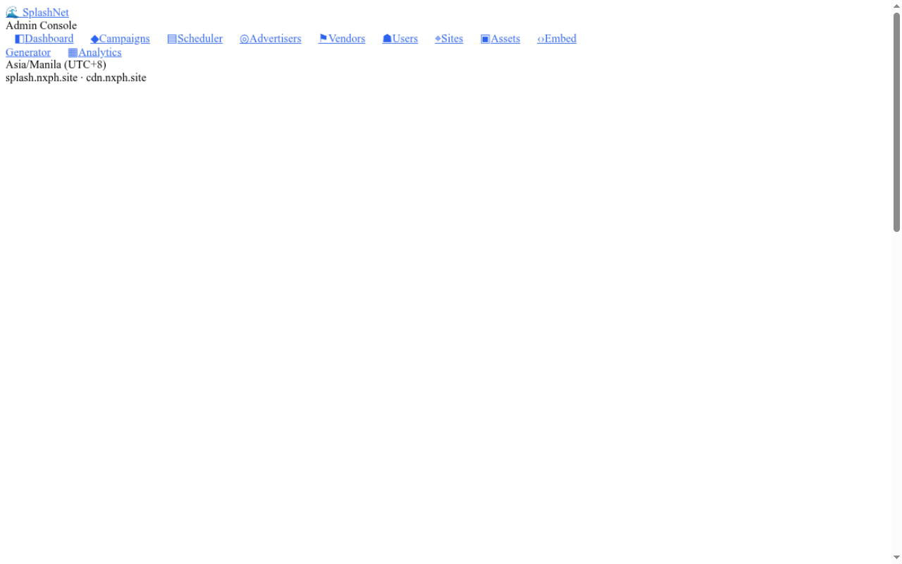 |
| Sites (retarget buttons) | `/sites` | 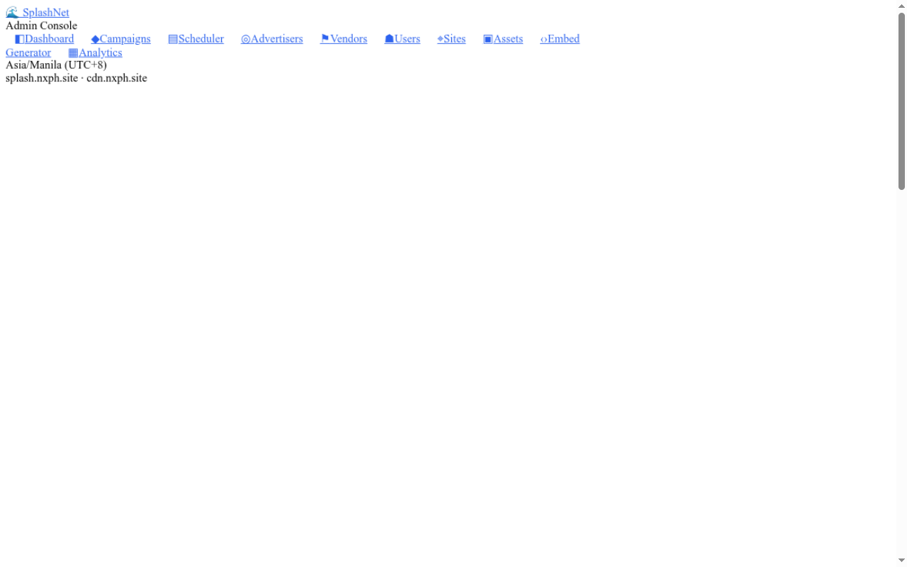 |
| Users (staff/advertiser/vendor logins) | `/users` | 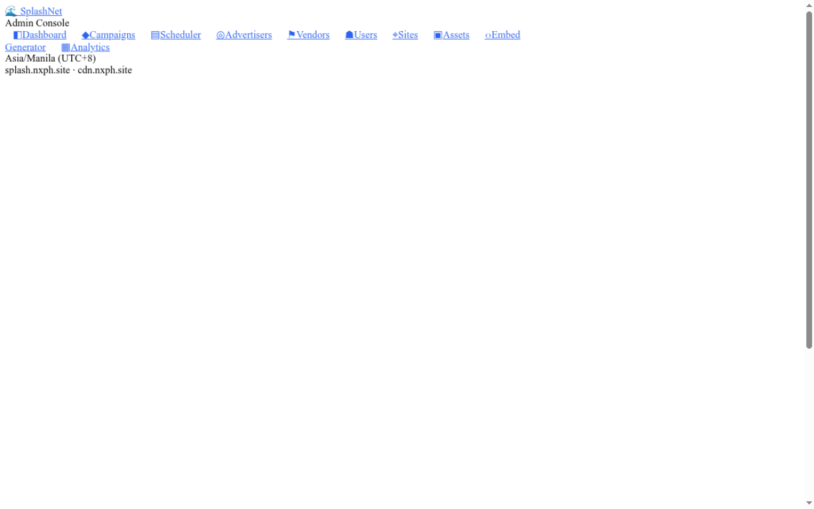 |
| Analytics (metrics + geo) | `/analytics` | 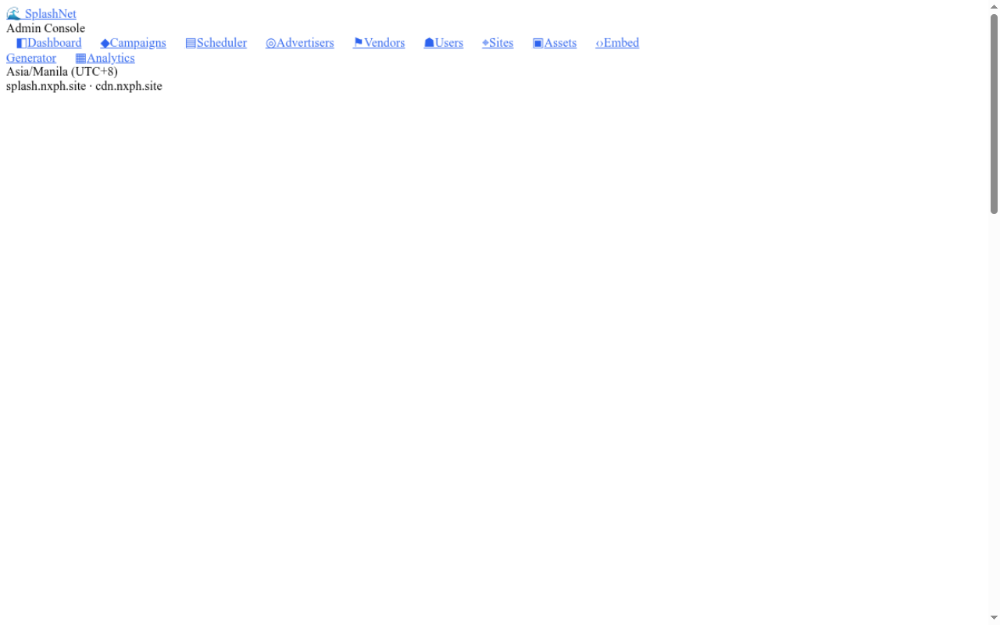 |
| Advertisers / Vendors / Assets / Embed | `/advertisers` `/vendors` `/assets` `/embed` | via sidebar (same session) |

### C. Advertiser Portal (advertiser login — the "place ads like Google Ads" surface)
| Nav item | Route | Proof |
|---|---|---|
| Dashboard (chart, spend) | `/portal` | 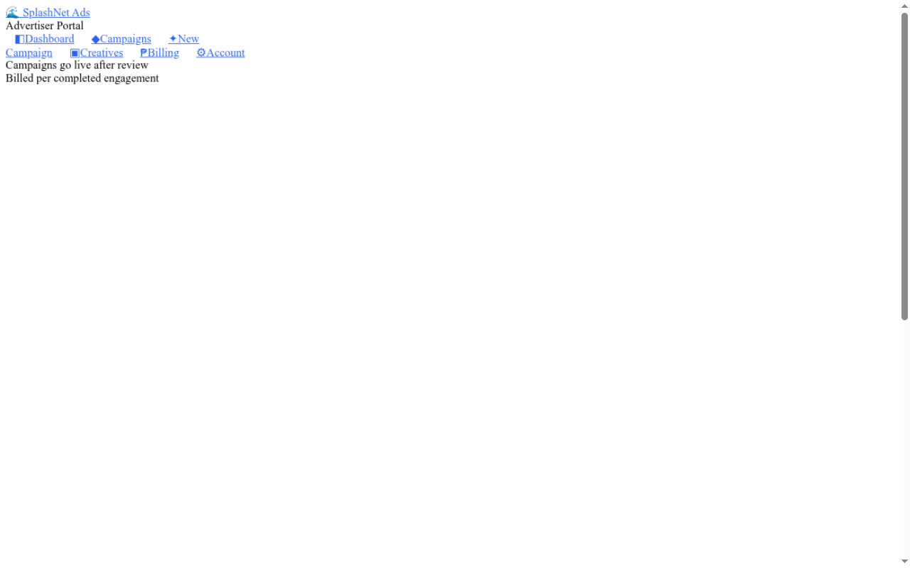 |
| New Campaign (builder: picker, preview, dayparting, reach) | `/portal/new` |  |
| Billing (ledger, budgets) | `/portal/billing` | 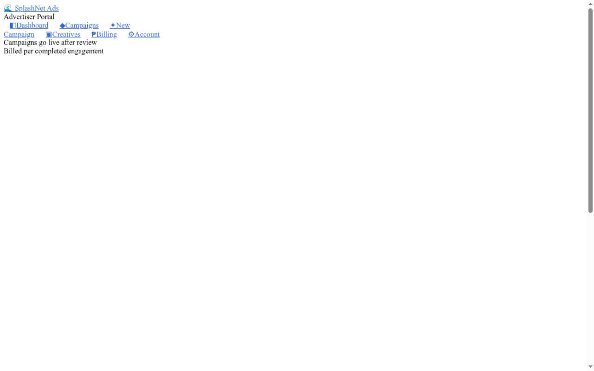 |
| Campaigns / Creatives / Account | `/portal/campaigns` `/portal/creatives` `/portal/settings` | via sidebar |

### D. Operator Console (vendor login)
| Nav item | Route | Proof |
|---|---|---|
| Dashboard (income, running-on-your-portals) | `/operator` | 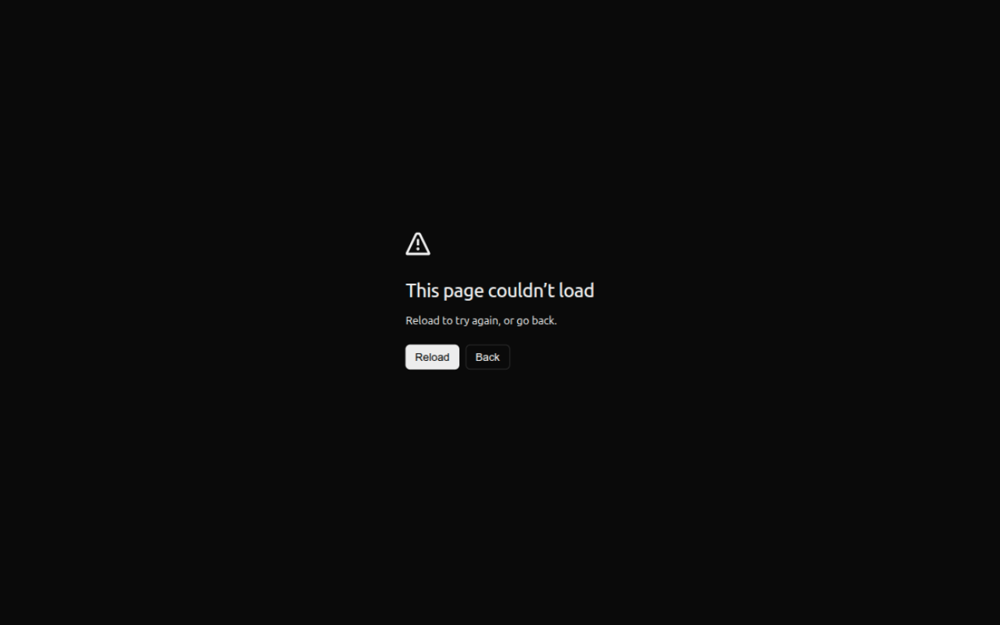 |
| My Sites & Connect (wizard + test) | `/operator/sites` | 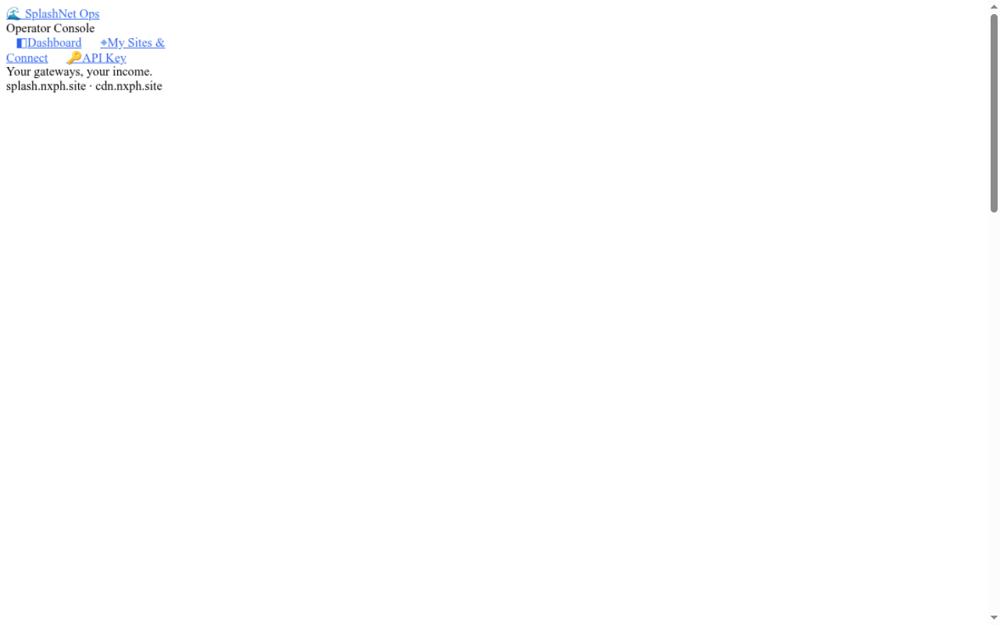 |
| API Key (rotation) | `/operator/api-key` |  |

### E. Public & portal surfaces
| Surface | URL | Proof |
|---|---|---|
| Hosted income quick-view (API key) | `/vendor` | 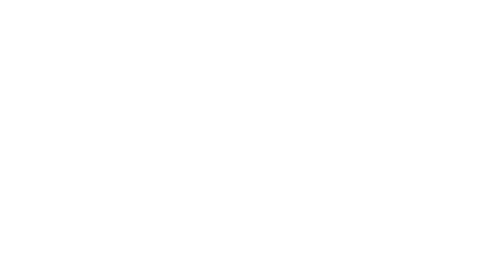 |
| JuanFi portal: ad + 5s coin gate (user view) | `demo.nxph.site/login.html` | 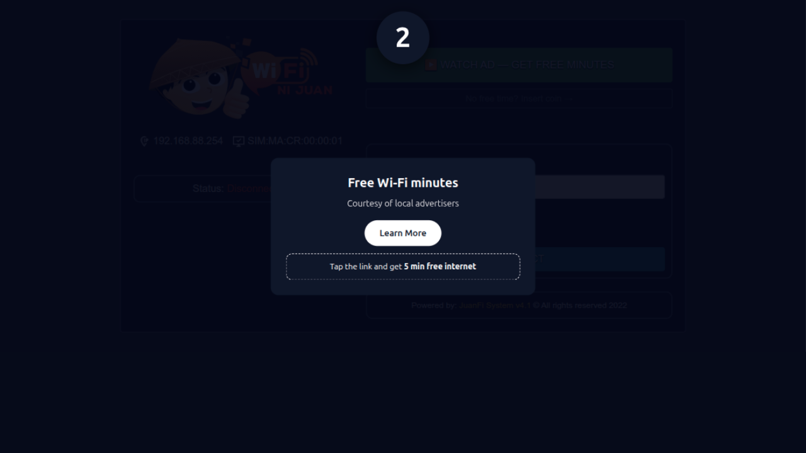 |
| JuanFi vendo admin (upstream, hash-verified) | `vendo:8081/system-config.html` | 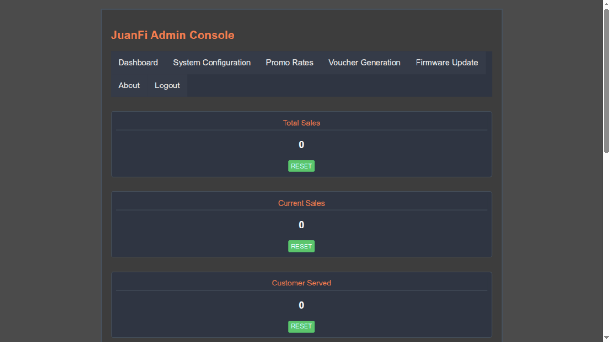 |

## Part 3 — Machine-verified evidence (non-UI)

- `scripts/qa-matrix.py` — 40 API checks incl. economy, tenancy, cohesion
- `npm test` — 12 unit tests (Manila time, slot math, reward-token crypto)
- Architecture QA report — Redis-outage drill (defect found+fixed), security
- Live cohesion trace — advertiser → site → user → operator income (§6.5)
- `git log` in github.com/logicminer/juanfi-splashnet — fork provenance,
  zero binaries, Apache-2.0 NOTICE

## Known exclusions (per contract)

Module A (₱45k), B (₱40k), C (₱50k) — quoted separately. Domain runs on
`nxph.site` (BRD's `splashnet.ph` is a placeholder per client instruction).
